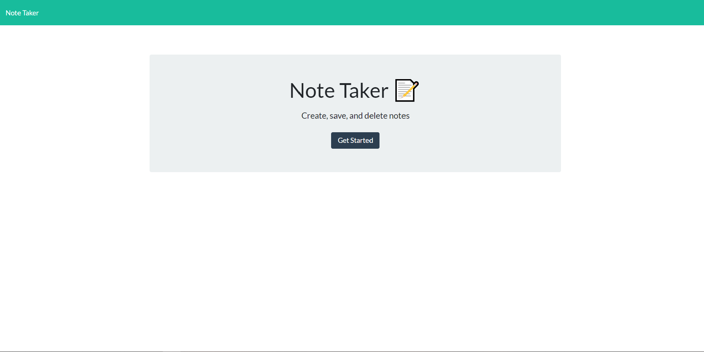
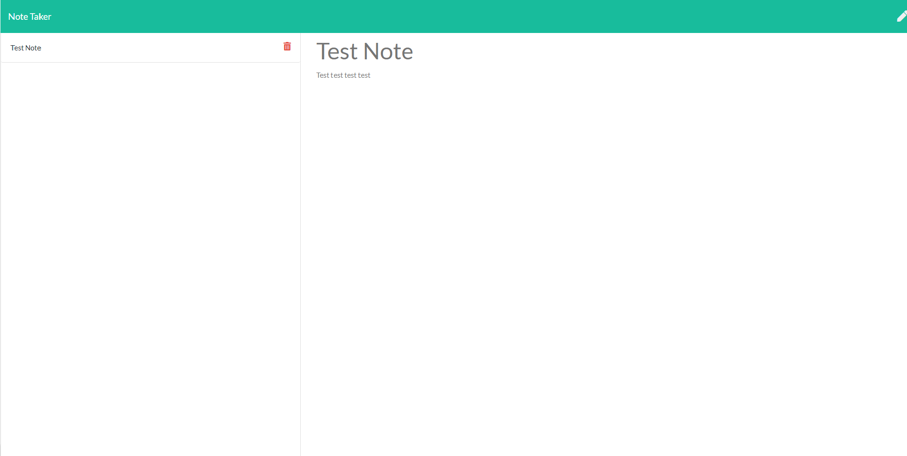

## Note Taker

The application gives yout the following options:
* Note-taking application
* I am presented with a landing page with a link to a notes page
* I click on the link to the notes page
* I am presented with a page with existing notes listed in the left-hand column, plus empty fields to enter a new note title and the note’s text in the right-hand column.
* I enter a new note title and the note’s text
* A Save icon appears in the navigation at the top of the page
* I click on the Save icon
* the new note I have entered is saved and appears in the left-hand column with the other existing notes
* I click on an existing note in the list in the left-hand column
* that note appears in the right-hand column
* I click on the Write icon in the navigation at the top of the page
* I am presented with empty fields to enter a new note title and the note’s text in the right-hand column

# Dependencies
---
* [Node.js](https://nodejs.org/en/) - JavaScript runtime environment

# Installation
---
Clone the Code to your Local
Run `npm install` from your Terminal to install all dependencies.
Then run the server, type into your Terminal
`Node server.js`

and then open http://localhost:3001 in your browser.

    

Add a note

    

Application it is deployed on Heroku at the link Below.

## Links
---
Heroku: https://notetaker98.herokuapp.com/
Repo: https://github.com/Ceven8498/Note-Taker